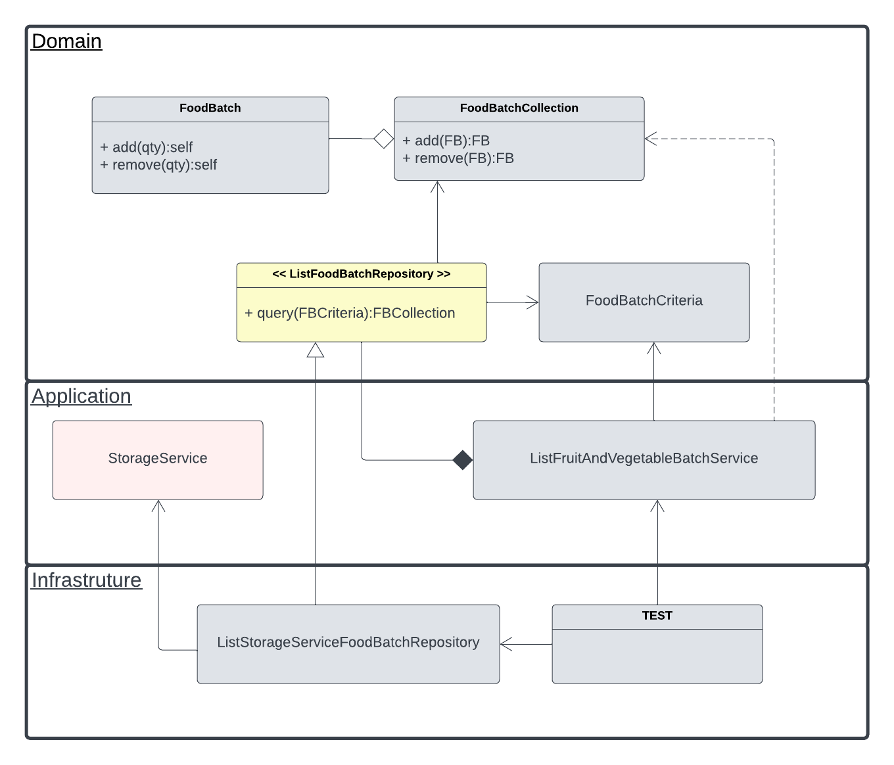

The service responding to the question asked is `ListFruitAndVegetableBatchService`. The corresponding test shows how it works: `ListFruitAndVegetableBatchServiceTest`

Below is a diagram showing an overview of the class structure - we leveraged an hexagonal architecture.

The domain objects `FoodBatch` and `FoodBatchCollection` implement methods to add of remove a given quantity of food. Also some care has been put to avoid issues related to the case of the inputs (lower and upper case letters).

Criteria is used to filter vegetables and fruits. It is the place where additional filters should be implemented.

Repositories can implement our interface and fit our specific needs. New interfaces can be added, for example to manage write and update operations of our collections.

Note: Id did not make it into our Domain. Depending on our storage model, we may want to introduce it back.